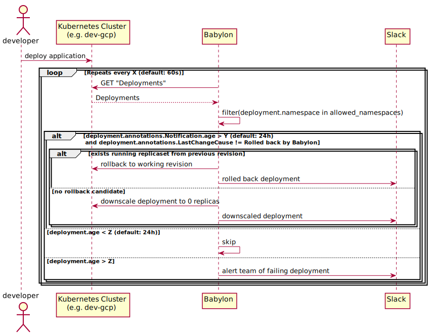

# Babylon - Project Gardener [](https://github.com/nais/babylon/actions/workflows/pipeline.yaml) [](https://github.com/nais/babylon/actions/workflows/codeql.yaml) [](https://goreportcard.com/report/github.com/nais/babylon)

## About

By default, the application will not perform destructive actions. To arm it set the `ARMED` 💥 environment variable to true. 

## Primary workflow



## Configure `ALLOWED_NAMESPACES` 

By default, babylon looks for broken deploys in all namespaces, but this can be configured. If want to enable the allowlist, set the environment variable `USE_ALLOWED_NAMESPACES`
to `true`, and add your namespaces to the environment variable `ALLOWED_NAMESPACES`, like `default,babylon`. 

**Note:** `ALLOWED_NAMESPACES` is a comma seperated string without whitespace. 

## Configuring working hours

Working hours can be configured by creating a file called `working-hours.yaml` in `/etc/config`, the syntax used
is the exact same as Prometheus' Alertmanager, see their
[docs](https://www.prometheus.io/docs/alerting/latest/configuration/#mute_time_interval).
Working hours only limit when resource pruning, limiting when alerts are received is awaiting features
in Alerterator.

## Skipping integration tests on CI

If the need arises for skipping the integration tests, say you need to deploy rapidly to test something you can skip them
by adding `[skip integration]` to the commit message. **NOTE:** This should _only_ be used when the integration tests are 
too slow for your needs.

## Using `make`

```shell
# To build and deploy
$ make # make deploy-local works too
# To check linting
$ make lint
```

## Local kubernetes development 

```sh 
$ minikube start

$ eval $(minikube -p minikube docker-env)

$ docker build -t babylon .

$ kubectl apply -f minikube.yaml
```

### Integration tests with `kuttl`

We have set up integration tests using `kuttl`. The tests are found in [`tests/e2e`](tests/e2e), 
see `kuttl`'s [documentation](https://kuttl.dev/docs/). All tests will have a running instance of babylon
in the background, as specified in [`tests/before/babylon.yaml`](tests/before/babylon.yaml). 

Tests work by specifying a cluster configuration, and then performing assertions on that configuration.
For example asserting that babylon has deleted some kind of resource.

### Setup kuttl

#### Automatically

```shell
$ make test
```

#### Manually

```sh
# install packages
$ brew tap kudobuilder/tap
$ brew install kuttl-cli

# run integration tests with kubernetes-in-docker (KIND)
$ kubectl kuttl test

# or you can run integration tests with minikube
$ minikube start
$ kubectl kuttl test --start-kind=false
```

### Access running application

```shell
$ minikube ip
192.168.64.2 # example, copy your own
$ sudo $EDITOR /etc/hosts
192.168.64.2 babylon.local
$ sudo killall -HUP mDNSResponder
```

### Developer setup

You must have pre-commit installed, then run `make hooks` to install git hooks. 

### Local InfluxDB testing

`minikube.yaml` contains setup for InfluxDB instance. 


**Prerequisites**
- Setup `influxdb.local` in etc/hosts. See "Access running application" section.

Test query to query the data from the InfluxDB instance:

```bash
curl -G 'http://influxdb.local/query?pretty=true' --data-urlencode "db=testdb" --data-urlencode "q=SHOW SERIES"
```