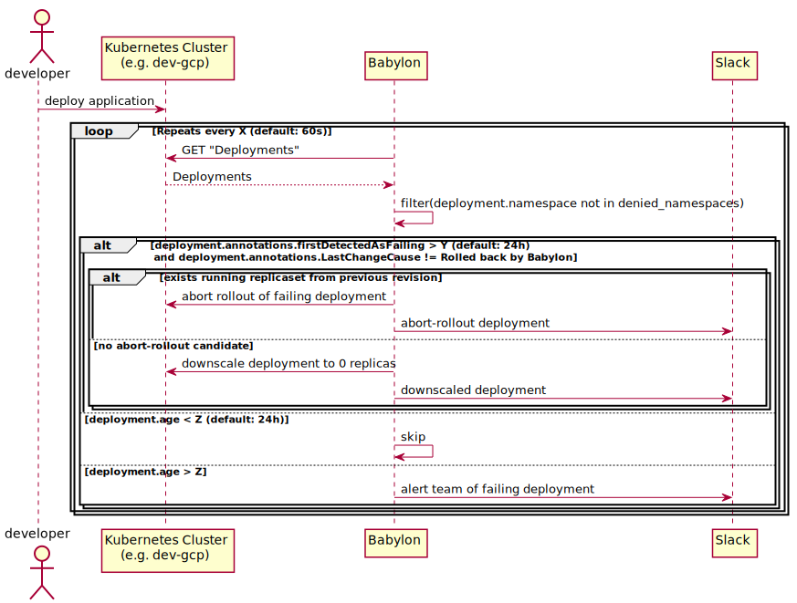

# Babylon   

## About

Babylon detects failing applications in your kubernetes cluster, notifies the responsible 
teams, and cleans them up. By doing this, Babylon will give tidy clusters and avoid 
unnecessary resource usage.

## Primary workflow

## Configure `ALLOWED_NAMESPACES` 

By default, babylon looks for broken deploys in all namespaces, but this can be configured. If want to enable the allowlist, set the environment variable `USE_ALLOWED_NAMESPACES`
to `true`, and add your namespaces to the environment variable `ALLOWED_NAMESPACES`, like `default,babylon`. 

**Note:** `ALLOWED_NAMESPACES` is a comma seperated string without whitespace. 

## Configuring working hours

Working hours can be configured by creating a file called `working-hours.yaml` in `/etc/config`, the syntax used
is the exact same as Prometheus' Alertmanager, see their
[docs](https://www.prometheus.io/docs/alerting/latest/configuration/#mute_time_interval).
Working hours only limit when resource pruning, limiting when alerts are received is awaiting features
in Alerterator.

## Resource cleanup

### Criteria for pruning

| Type of Error | Reason        |
| ------------- | -------------| 
|  `CreateContainerConfigError`     |  A container could not be created due to errors in the resource definition. Happens when e.g., you try to reference a config map that doesn't exist/is missing keys | 
| `ImagePullBackOff`/`ErrImagePull`      | Happens when a container cannot find/pull an image from its registry, usually terminal. This check is for both containers in a deployment and their init containers     |   
| `CrashLoopBackOff` | Happens when the application inside the container crashes and/or restarts, see restart threshold below. This check is for both containers in a deployment and their init containers     |

### Configuration parameters 

| Name | Default | Description       |
| -------------| ----- | -------------| 
| `ARMED` | `false` | By default, the application will not perform destructive actions. To arm it set the `ARMED` 💥 environment variable to true.| 
| `RESOURCE_AGE` | `10m` | Any resources younger than this threshold will not be checked |  
| `NOTIFICATION_TIMEOUT` | `24h` | If a resource (currently only deployments) has been annotated with `babylon.nais.io/last-notified` it is skipped while the notification is younger than the configured value |
| `GRACE_PERIOD` | `24h` | The grace period starts with the first notification related to a resource. Resources will be handled (e.g. deleted, downscaled, or rolled back) at some point after the grace period has ended.  |
| `RESTART_THRESHOLD` | `200` | During `CrashLoopBackOff` the pod will be ignored while the number of restarts is less than the threshold |
| `TICKRATE` | `15m` | The tick rate is the duration for which the application's main loop will wait between each run (somewhat similar to `Time.sleep`) | 
| `LINKERD_DISABLED` | none | Disable waiting on Linkerd sidecar during startup. | 
| `UNLEASH_URL` | none | URL to connect to [Unleash](https://github.com/Unleash/unleash) |
| `USE_ALLOWED_NAMESPACES` | `false` | Only allow Babylon to perform cleanup in allowed namespaces specified by `ALLOWED_NAMESPACES` |
| `ALLOWED_NAMESPACES` | none | Comma-separated list of namespaces (without whitespace) where cleanup is allowed. |

### Contributing to Babylon

For development setup, see [CONTRIBUTING.md](CONTRIBUTING.md). 